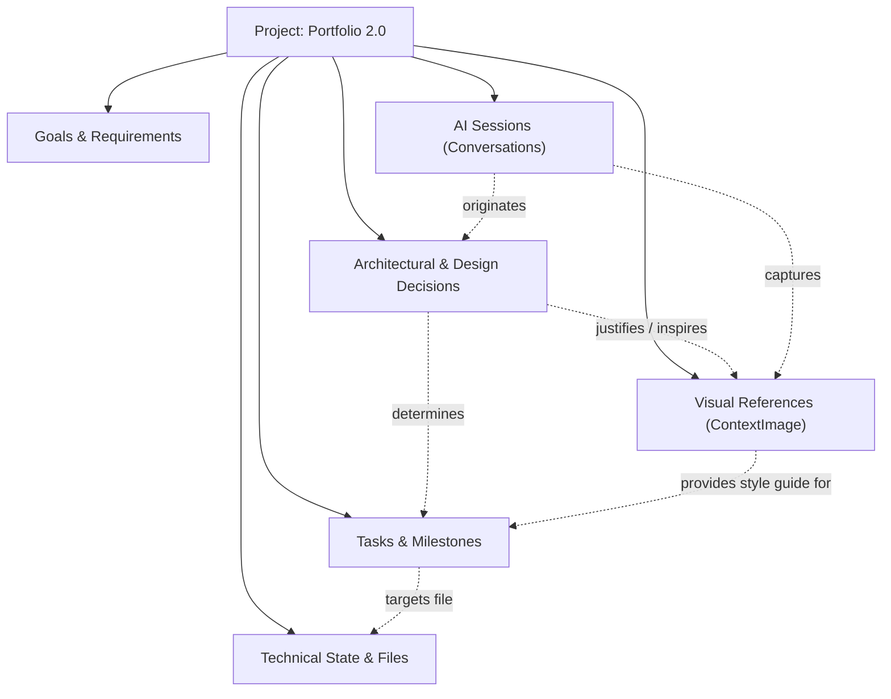

# Continuo Context OS Architecture

## Executive Summary

Continuo is evolving from an **inter-model conversation handoff utility** into a **Persistent Context Operating System (Context OS)**. 

The original Continuo pipeline addressed a discrete pain point: moving a working conversation from one AI model (e.g., ChatGPT) to another (e.g., Claude) without re-explaining context. The next evolution elevates Continuo to an ongoing, persistent memory layer that anchors all project context—decisions, goals, tasks, technical boundaries, session history, and crucially, **first-class visual references**—across multi-day, multi-tool AI engineering lifecycles.

```
Conversation Continuity  ──►  Project Continuity  ──►  Persistent Context OS
   (Single Dialogue)           (Versioned Memory)       (Multi-Modal Memory Layer)
```

This document presents a comprehensive architecture and safety audit of the existing Continuo repository, analyzes existing components, and specifies the complete data, visual, relational, retrieval, and security architectures for Context OS without breaking existing production behavior.

---

## 1. Current Architecture

The existing Continuo system is structured as an extension-first companion application backed by a modular FastAPI service and a static responsive frontend.

```
┌─────────────────────────────────────────────────────────────────────────────┐
│                             CLIENT INTERFACES                               │
├─────────────────────────────────────────┬───────────────────────────────────┤
│          CHROME EXTENSION (MV3)         │        CONTINUO WEB FRONTEND      │
│  - popup.html / popup.js (7 UX states)  │  - index.html (Responsive landing)│
│  - content.js (DOM scraping adapters)   │  - main.js (Workspace memory app) │
│  - background.js (Service worker)       │  - styles.css (Glassmorphic theme)│
└─────────────────────────────────────────┴───────────────────────────────────┘
                                     │
                             HTTPS / JSON REST
                                     ▼
┌─────────────────────────────────────────────────────────────────────────────┐
│                           FASTAPI GATEWAY (v1)                              │
│                          (backend/main.py : 8008)                           │
├─────────────────────────────────────────────────────────────────────────────┤
│  Middleware:                                                                │
│  - CORS Middleware (Allowing Vercel, Render, Localhost, & Chrome Extensions)│
│  - Global Exception Handler (Sanitized 500 responses in production)         │
│                                                                             │
│  Routers:                                                                   │
│  - /api/v1/auth       (Registration, login, logout, profile introspection) │
│  - /api/v1/projects   (Project lifecycle and ownership verification)        │
│  - /api/v1/context    (Dialogue capture, stateless analysis, curation)     │
│  - /api/v1/versions   (Version history and granular structural diffs)       │
│  - /api/v1/handoffs   (Provider continuation generation & secret scrubbing) │
│  - /api/v1/admin      (Protected system diagnostics via role-based access)  │
└─────────────────────────────────────────────────────────────────────────────┘
                                     │
                     SQLAlchemy 2.0 ORM Engine & Models
                                     ▼
┌─────────────────────────────────────────────────────────────────────────────┐
│                              PERSISTENCE LAYER                              │
├──────────────────────────────────────┬──────────────────────────────────────┤
│      DEVELOPMENT & LOCAL TESTING     │        PRODUCTION DEPLOYMENT         │
│     SQLite (continuo.db)             │     PostgreSQL 15+ (Supabase / Neon) │
│     Auto Base.metadata.create_all()  │     Alembic Migrations (0001_initial)│
└──────────────────────────────────────┴──────────────────────────────────────┘
```

### 1.1 Repository Structure
```
continuo/
├── backend/
│   ├── config.py                 # Pydantic Settings & dynamic CORS validation
│   ├── database.py               # SQLAlchemy engine, session maker, migration hook
│   ├── main.py                   # FastAPI application entrypoint & middleware
│   ├── models/
│   │   └── __init__.py           # User, Project, ContextPackage, Conversation, Version, Handoff
│   ├── routers/
│   │   ├── admin.py              # Protected diagnostics (/admin)
│   │   ├── auth.py               # Authentication & token issuing (/auth)
│   │   ├── context.py            # Transcript ingestion & context curation (/context)
│   │   ├── handoffs.py           # Universal handoff generation (/handoffs)
│   │   ├── projects.py           # Project CRUD & baseline initialization (/projects)
│   │   └── versions.py           # Version history & diff computation (/versions)
│   ├── schemas/
│   │   └── __init__.py           # Pydantic v2 schemas for all payloads & responses
│   └── services/
│       ├── auth.py               # PBKDF2 hashing, JWT signing, role checking
│       ├── context_engine.py     # Deterministic 15-attribute regex extraction engine
│       ├── contradiction.py      # Architectural decision conflict detector
│       ├── handoff_generator.py  # Standardized 11-part markdown handoff & secret sanitizer
│       ├── quality_scorer.py     # 4-factor dynamic mathematical quality scorer (0-100)
│       └── version_diff.py       # Semantic delta calculator (added, modified, removed)
├── extension/
│   ├── manifest.json             # Chrome MV3 schema with minimal host permissions
│   ├── popup.html / popup.js     # 7-state companion popup controller
│   ├── content.js                # Multi-strategy DOM extractors for ChatGPT/Claude/Gemini
│   └── background.js             # Background service worker
├── alembic/                      # Database schema revision tracking
├── dist/                         # Release archives (continuo-extension.zip)
├── docs/                         # Submission guides & privacy commitments
├── scripts/                      # Packaging, adapter tests, and verification scripts
├── tests/                        # 30 automated Pytest test cases (100% pass)
├── index.html / main.js          # Interactive web application and Project Workspace UI
├── verify_cta.py                 # Comprehensive CTA & distribution flow verification
└── continuo.db                   # Local SQLite database
```

### 1.2 Frontend Architecture
- **Web Client**: Plain HTML5, Vanilla JavaScript (`main.js`), and Vanilla CSS (`styles.css`). Employs Lenis smooth scrolling, canvas context flow background, and an integrated `#workspace` application.
- **Workspace UI**: Enables users to log in, register, create/select projects, paste raw dialogue transcripts to synthesize context packages, manually edit context fields in a Memory Editor, inspect semantic version diffs, and generate cross-AI handoff packages.

### 1.3 Backend & Storage Architecture
- **Framework**: FastAPI with Python 3.12+ type hints and Pydantic v2.
- **Database Engine**: SQLAlchemy 2.0 with engine abstraction:
  - Local/Dev: SQLite (`continuo.db`) with `check_same_thread=False`.
  - Production: PostgreSQL with connection pooling (`pool_size=10`, `max_overflow=20`, `pool_pre_ping=True`, `pool_recycle=300`).
- **Database Migrations**: Alembic manages production schemas to prevent DDL race conditions across concurrent application workers.

---

## 2. Existing Context Pipeline

The existing context pipeline is a unidirectional ingestion and formatting loop:

```
[ Active AI Tab ]
 (ChatGPT / Claude / Gemini)
       │
       ▼ (DOM Extraction via content.js)
[ Raw Message Turns ]
       │
       ▼ (POST /api/v1/context/capture)
[ ContextEngine.extract() ]  ──►  Regex Heuristic Extraction (15 fields)
       │
       ▼
[ QualityScorer.evaluate() ] ──►  Mathematical scoring & Contradiction detection
       │
       ▼
[ ContextPackage Record ]    ──►  Stored in SQLite / PostgreSQL (JSON text blobs)
       │
       ▼ (POST /api/v1/handoffs)
[ HandoffService.generate() ]──►  11-part standardized continuation payload
       │
       ▼
[ Clipboard Copy & Provider Open ]
```

### 2.1 Extraction Flow (`ContextEngine`)
`backend/services/context_engine.py` processes raw conversational dialogue using regular expressions and keyword pattern matching across 15 structured attributes:
1. `objective`: Regex patterns targeting goals, purposes, or initial user requests.
2. `requirements`: Matches modal verbs ("must", "need to", "feature:").
3. `constraints`: Matches negation constraints ("do not", "never", "cannot").
4. `instructions`: Matches operational guidance ("always", "keep in mind").
5. `decisions`: Identifies architectural conclusions ("decided", "switched to").
6. `current_state`: Synthesizes current development phase.
7. `completed_work`: Extracts marked progress and completed tasks.
8. `pending_work`: Extracts pending action items.
9. `open_problems`: Identifies unresolved bugs or bottlenecks.
10. `errors`: Captures stack traces or error snippets.
11. `failed_attempts`: Logs discarded paths to prevent loops.
12. `files_context`: Regex extraction of code paths (`.py`, `.ts`, `.json`, etc.).
13. `design_decisions`: Identifies UI/UX choices (glassmorphism, typography, colors).
14. `dependencies`: Identifies framework and library mentions.
15. `next_steps`: Gathers immediate sequential actions.

### 2.2 Storage Model (`ContextPackage`)
Extracted context is stored in `context_packages`. The table serializes lists as JSON strings (`requirements_json`, `constraints_json`, `decisions_json`, etc.) with helper methods `get_list()` and `set_list()`. Each capture triggers a version bump (e.g., `v1.0` -> `v1.1`), creates a `Conversation` record storing the raw transcript, and adds a `ProjectVersion` record.

### 2.3 Quality Scoring & Contradiction Guard
- `QualityScorer`: Computes a 0–100 score across Completeness (30%), Structural Clarity (25%), Actionability (25%), and Consistency (20%).
- `ContradictionDetector`: Scans for mutual exclusivity in decisions (e.g., SQLite vs PostgreSQL, Tailwind vs Vanilla CSS, Auth0 vs Custom JWT).

### 2.4 Handoff Generation (`HandoffService`)
`backend/services/handoff_generator.py` dispatches context to provider adapters (`ClaudeProviderAdapter`, `ChatGPTProviderAdapter`, `GeminiProviderAdapter`, `CursorProviderAdapter`).
- Formats context into a standardized 11-part markdown continuation payload:
  `PROJECT:`, `OBJECTIVE:`, `CURRENT STATE:`, `COMPLETED:`, `CURRENTLY WORKING ON:`, `IMPORTANT DECISIONS:`, `CONSTRAINTS:`, `KNOWN ISSUES:`, `FILES / CODE CONTEXT:`, `FAILED ATTEMPTS:`, `NEXT STEPS:`, `CONTINUE FROM HERE:`.
- `sanitize_secrets()` redacts JWT tokens, API keys (`sk-...`, `Bearer ...`), passwords, and database connection strings before delivery.

---

## 3. Existing Project Model

In the current schema (`backend/models/__init__.py`), `Project` serves as the primary organizational container:

```python
class Project(Base):
    __tablename__ = "projects"

    id = Column(String(36), primary_key=True, default=generate_uuid)
    user_id = Column(String(36), ForeignKey("users.id"), nullable=False, index=True)
    name = Column(String(255), nullable=False)
    description = Column(Text, nullable=True)
    current_version = Column(String(32), default="v1.0")
    health_score = Column(Float, default=85.0)
    created_at = Column(DateTime, default=utc_now)
    updated_at = Column(DateTime, default=utc_now, onupdate=utc_now)

    user = relationship("User", back_populates="projects")
    context_packages = relationship("ContextPackage", back_populates="project", cascade="all, delete-orphan")
    conversations = relationship("Conversation", back_populates="project", cascade="all, delete-orphan")
    versions = relationship("ProjectVersion", back_populates="project", cascade="all, delete-orphan")
    handoffs = relationship("Handoff", back_populates="project", cascade="all, delete-orphan")
```

### Lifecycle & Cascades:
- **Creation**: When a project is created via `POST /api/v1/projects`, an initial `ContextPackage` (`v1.0`) and initial `ProjectVersion` (`v1.0`) are automatically populated.
- **Cascading Deletion**: Deleting a project explicitly deletes associated `Handoff`, `ProjectVersion`, `Conversation`, and `ContextPackage` records, preventing orphan rows across both SQLite and PostgreSQL.

---

## 4. Existing User Isolation

Continuo enforces strict multi-tenant isolation at the application and query layers:

1. **Token Authentication**: Every protected request must provide a valid JWT Bearer token signed with the server's `SECRET_KEY`.
2. **User Identity Injection**: `get_current_user` extracts `sub` (the user UUID) and queries the active user record.
3. **Ownership Enforced on Every Operation**:
   - `/projects/{id}`: Asserts `project.user_id == current_user.id`.
   - `/context/capture`: Resolves `project_id`, asserts `project.user_id == current_user.id`.
   - `/context/projects/{id}/context`: Asserts `project.user_id == current_user.id`.
   - `/versions/projects/{id}`: Asserts `project.user_id == current_user.id`.
   - `/handoffs`: Asserts `project.user_id == current_user.id`.
   - Any foreign access attempt immediately raises `HTTP 403 Forbidden`.
4. **Role-Based Diagnostics**: Diagnostic endpoints (`/api/v1/admin/diagnostics`) require explicit role membership (`admin` or `developer`).
5. **Automated Test Coverage**: Verified by `test_comprehensive_cross_user_data_isolation` in `tests/test_api_endpoints.py` with 15 separate 403/401 assertions across all endpoints.

---

## 5. Reusable Components

The following components are robust and can be directly reused as the foundation for Context OS:

| Component | File Path | Capability & Reusability |
|---|---|---|
| **PBKDF2 & JWT Auth** | `backend/services/auth.py` | Secure authentication with zero native C-compilation dependencies. Reusable for all new endpoints. |
| **User & Project Models** | `backend/models/__init__.py` | Core tenant and project models; new Context OS entities can anchor directly to `projects.id`. |
| **Database & Session Management** | `backend/database.py` | Handles SQLite and PostgreSQL connection pooling, Alembic hooks, and transactional session lifecycle. |
| **Secret Sanitization Engine** | `backend/services/handoff_generator.py` | Regex scrubber for keys, tokens, credentials, and connection strings. Crucial for visual metadata and prompts. |
| **Quality Scorer** | `backend/services/quality_scorer.py` | Can be expanded from text scoring to evaluate completeness of visual assets and decision records. |
| **Contradiction Detector** | `backend/services/contradiction.py` | Rule-based conflict detection engine. Can be extended to detect design and technical requirement contradictions. |
| **Version Diff Engine** | `backend/services/version_diff.py` | Granular diff calculation across list and scalar attributes. Reusable for tracking context evolution. |
| **DOM Provider Adapters** | `extension/content.js` | Modular ChatGPT, Claude, and Gemini extractors. Reusable for extracting visual references and chat screenshots. |
| **Handoff Dispatcher** | `backend/services/handoff_generator.py` | Clean provider abstraction for ChatGPT, Claude, Gemini, and Cursor. |
| **Automated Packaging** | `scripts/package-extension.py` | Deterministic build and security audit script for releasing extension updates. |

---

## 6. Required Changes for Context OS

To evolve from single-dialogue capture into a Persistent Context OS, the following architectural upgrades are required:

1. **From Monolithic Snapshot to Granular Relational Context**:
   Currently, a `ContextPackage` stores entire sets of requirements and decisions as serialized JSON strings inside a single row. Context OS requires individual, identifiable context entities (Goals, Requirements, Decisions, Tasks, Visual References) that can be queried, tagged, linked, and independently updated.
2. **First-Class Visual References**:
   The current schema has no table or attribute for image assets, screenshots, or design references. Images must become first-class relational entities with visual semantic metadata and bi-directional links to decisions and technical context.
3. **Session Concept**:
   Currently, `Conversation` stores raw transcripts per capture. This must evolve into `AISession`, recording interaction turns, model identity, source prompts, and extracted learnings.
4. **Context Association & Graph Links**:
   Entities must cross-reference each other (e.g., an architectural decision links to a visual diagram and a specific session).
5. **Intelligent Sub-Context Retrieval**:
   Instead of dumping all project facts into every continuation prompt, Context OS requires an intent-aware retrieval engine that pulls only relevant decisions, assets, and images for the task at hand.
6. **Multi-Modal Continuation Payloads**:
   The handoff generator must format continuation packages containing both structured text context and referenced visual assets (URLs, thumbnails, or multi-modal attachment specifications).

---

## 7. Proposed Context Model

The Context OS data model introduces dedicated, normalized entities linked to `projects.id`, while maintaining full backward compatibility with legacy `ContextPackage` snapshots.

```
                     ┌──────────────────────┐
                     │        User          │
                     └──────────┬───────────┘
                                │ 1:N
                     ┌──────────▼───────────┐
                     │       Project        │
                     └──────────┬───────────┘
                                │
        ┌───────────────┬───────┴───────┬───────────────┐
        │ 1:N           │ 1:N           │ 1:N           │ 1:N
┌───────▼───────┐┌──────▼───────┐┌──────▼───────┐┌──────▼───────┐
│ ContextGoal   ││ ContextDecis.││ ContextImage ││  AISession   │
│ - goals       ││ - title      ││ - visual ref ││ - provider   │
│ - requirements││ - rationale  ││ - metadata   ││ - transcript │
│ - constraints ││ - status     ││ - tags       ││ - model      │
└───────┬───────┘└──────┬───────┘└──────┬───────┘└──────┬───────┘
        │               │               │               │
        └───────────────┼───────────────┴───────────────┘
                        ▼
            Context Associations / Graph Links
```

### Entity Specifications

#### 1. `ContextGoal` & `ContextRequirement`
- **Purpose**: Tracks project objectives, constraints, and acceptance criteria.
- **Attributes**: `id`, `project_id`, `category` (`objective`, `functional_requirement`, `constraint`, `instruction`), `title`, `description`, `priority` (`critical`, `high`, `normal`), `status` (`active`, `satisfied`, `deprecated`), `created_at`, `updated_at`.

#### 2. `ContextDecision`
- **Purpose**: Explicitly preserves engineering and design decisions to prevent downstream models from questioning or reversing choices.
- **Attributes**: `id`, `project_id`, `title`, `category` (`architecture`, `design_system`, `database`, `api`, `auth`), `rationale`, `alternatives_considered_json`, `constraints_created_json`, `status` (`accepted`, `superseded`, `under_review`), `created_at`.

#### 3. `ContextTechnicalState`
- **Purpose**: Real-time snapshot of runtime environment, tech stack, and file boundaries.
- **Attributes**: `id`, `project_id`, `tech_stack_json`, `dependencies_json`, `files_in_scope_json`, `environment_variables_json` (sanitized), `known_issues_json`, `failed_attempts_json`.

#### 4. `ContextTask` & `ContextMilestone`
- **Purpose**: Tracks what work is complete, currently active, and queued next.
- **Attributes**: `id`, `project_id`, `milestone_id`, `title`, `description`, `status` (`pending`, `in_progress`, `completed`, `blocked`), `blocked_by_json`, `order_index`.

#### 5. `AISession` (Evolution of `Conversation`)
- **Purpose**: Maintains the history of conversations across AI platforms.
- **Attributes**: `id`, `project_id`, `provider` (`chatgpt`, `claude`, `gemini`, `cursor`), `model_name`, `session_title`, `source_url`, `turn_count`, `summary`, `raw_transcript`, `created_at`.

#### 6. `ContextAsset`
- **Purpose**: Tracks code snippets, config templates, and schema definitions associated with project state.
- **Attributes**: `id`, `project_id`, `name`, `asset_type` (`code_snippet`, `schema`, `config`, `document`), `content`, `language`, `created_at`.

---

## 8. Visual Context Model (First-Class Citizen)

In creative, frontend, and architectural engineering, visual context is as critical as written code. Images cannot be treated as generic unindexed binary blobs; they must be first-class semantic context.

### 8.1 Database Entity: `ContextImage`

```python
class ContextImage(Base):
    __tablename__ = "context_images"

    id = Column(String(36), primary_key=True, default=generate_uuid)
    project_id = Column(String(36), ForeignKey("projects.id"), nullable=False, index=True)
    
    # Classification & Provenance
    source = Column(String(64), nullable=False) 
    # 'upload', 'chat_screenshot', 'url', 'blender_render', 'figma_export', 'clipboard'
    
    image_type = Column(String(64), nullable=False)
    # 'ui_screenshot', 'design_inspiration', 'website_reference', 'character_reference', 
    # '3d_render', 'moodboard', 'diagram', 'before_after', 'decision_evidence'
    
    title = Column(String(255), nullable=False)
    description = Column(Text, nullable=True)
    
    # Storage References (Local filesystem path or cloud object key)
    storage_path = Column(String(512), nullable=False)
    thumbnail_path = Column(String(512), nullable=True)
    mime_type = Column(String(64), nullable=False)
    file_size_bytes = Column(Integer, nullable=False)
    image_hash = Column(String(64), nullable=False, index=True)  # SHA-256 deduplication
    
    # Visual & Semantic Metadata (JSON)
    # e.g., {"width": 1920, "height": 1080, "aspect_ratio": "16:9", "color_palette": ["#0f172a", "#38bdf8"]}
    dimensions_metadata_json = Column(Text, default="{}")
    
    # Structured Visual Tags (Extracted or Curated)
    # e.g., ["dark glass UI", "large 3D character", "minimal typography", "cinematic lighting"]
    visual_tags_json = Column(Text, default="[]")
    
    # Relational Context Links (Foreign ID arrays stored as JSON)
    associated_context_ids_json = Column(Text, default="[]")
    associated_decision_ids_json = Column(Text, default="[]")
    associated_session_id = Column(String(36), ForeignKey("conversations.id"), nullable=True)
    
    created_at = Column(DateTime, default=utc_now)
    updated_at = Column(DateTime, default=utc_now, onupdate=utc_now)

    project = relationship("Project", backref="visual_references")
```

### 8.2 Real-World Application Example

```
Project: Portfolio 2.0

Visual Reference:
- File: character_hero_render_v2.png
- Type: character_reference
- Source: blender_render
- Description: "Full-body 3D humanoid avatar standing on a glass pedestal under volumetric blue rim lighting."
- Visual Tags:
  * "dark glass UI"
  * "large 3D character"
  * "minimal typography"
  * "cinematic lighting"
- Associated Decision:
  * "DEC-004: Standardized on Three.js glTF character viewer with PBR materials and bloom effect."
- Associated Session:
  * Claude Session #4 (Discussing shader performance optimization).
```

When handing off to a visual or multimodal AI model (e.g., Claude 3.5 Sonnet, GPT-4o, or Gemini 1.5 Pro), Continuo provides both the structured architectural text AND links/descriptions/attachments of `character_hero_render_v2.png`.

---

## 9. Context Relationships

Context OS models real software projects as an interconnected relationship graph rather than an isolated list of strings.



### Relationship Rules:
1. **Decision ➔ Visual Reference**:
   A design decision (e.g., "Use glassmorphic cards with 12px blur") explicitly references one or more `ContextImage` entities (e.g., `moodboard_card_v1.png`).
2. **Session ➔ Decision & Visual**:
   When an AI session generates an architectural breakthrough or UI mockup, the session ID is stamped onto the newly created `ContextDecision` and `ContextImage`.
3. **Task ➔ Decision**:
   Tasks reference the decisions that justify their existence, preventing regressions.
4. **Project ➔ Context Aggregation**:
   The high-level project view provides instant access to current state, active tasks, approved decisions, and linked visuals.

---

## 10. Future Retrieval Architecture

### 10.1 The Context Window Problem
As projects evolve, they accumulate dozens of decisions, multiple conversations, numerous tasks, and dozens of visual references. Blindly dumping the entire project history into downstream model prompts causes:
- Severe token waste and high API costs.
- Context dilution and "lost in the middle" hallucinations.
- Confusion when downstream models encounter obsolete early-stage brainstorming.

### 10.2 Intent-Aware Semantic Retrieval
Context OS introduces an **Intent-Aware Sub-Context Retrieval Engine**:

```
[ User Request ]
"Continue Portfolio 2.0 and fix the character animation."
                       │
                       ▼
[ Context Retrieval Engine ]
  1. Parse intent & entities:
     - Project: "Portfolio 2.0"
     - Entity: "character animation"
     - Domains: ["3D", "animation", "rigging", "character"]
  2. Query Relational Graph:
     - Fetch Project Anchor: Name, version, base objective, current state.
     - Filter Decisions: Select decisions matching "character", "animation", or "3D".
     - Filter Visual References: Select images tagged "character_reference" or "3d_render".
     - Filter Tasks: Select active tasks where title/tag matches "animation".
     - Filter Technical Context: Include 3D loader files (`characterViewer.ts`, `rigging.js`).
     - Exclude: Unrelated backend database migrations, payment auth decisions.
                       │
                       ▼
[ Smart Context Composer ]
Synthesize tailored continuation prompt:
- Baseline Project Objective
- Focused Character Decisions & Constraints
- Referenced Image Descriptions & Asset Links
- Immediate Task: Fix animation stutter on character glTF
```

### 10.3 Token Budget Allocation
The Composer enforces strict token budgeting:
- **Project Identity & Current State**: 15% of budget.
- **Relevant Decisions & Constraints**: 30% of budget.
- **Active Task & Code Pointers**: 25% of budget.
- **Visual References & Descriptions**: 20% of budget.
- **User Custom Instructions**: 10% of budget.

---

## 11. Migration Strategy

To ensure zero downtime and prevent breaking existing users and database structures:

1. **Non-Destructive Schema Expansion**:
   - Keep existing tables (`users`, `projects`, `context_packages`, `conversations`, `project_versions`, `handoffs`) completely intact.
   - Introduce new Context OS tables via dedicated Alembic migration: `0002_context_os_entities.py`.
2. **API Backward Compatibility**:
   - Existing endpoints (`POST /api/v1/context/capture`, `POST /api/v1/handoffs`, `GET /api/v1/projects/{id}/context`) continue to function without alteration.
   - New endpoints are introduced under `/api/v1/context-os/...` or namespaced routes (e.g., `/api/v1/projects/{id}/visuals`, `/api/v1/projects/{id}/decisions`).
3. **Dual-Write / Lazy Migration**:
   - When `/context/capture` is called, it continues creating the snapshot `ContextPackage` while optionally populating normalized `ContextDecision` and `ContextTask` rows in the background.
4. **Environment Isolation**:
   - Development continues to use `continuo.db` (SQLite).
   - Production PostgreSQL databases apply migrations via `alembic upgrade head`.

---

## 12. Security Considerations

A Persistent Context OS handling user code, architectural decisions, and visual assets requires rigorous security boundaries:

### 12.1 User & Project Isolation
- Every query for an image, decision, task, or session must enforce:
  `project.user_id == current_user.id`.
- Foreign key traversals must assert ownership at both the parent project and child entity levels.

### 12.2 Visual Asset Access Control
- **No Public Directories**: Images must never be dumped into a publicly indexed static web folder without authentication.
- **Protected File Delivery**: Image binaries must be served via authenticated endpoints (e.g., `GET /api/v1/projects/{id}/visuals/{image_id}/file` requiring a valid Bearer token) or short-lived signed URLs (e.g., 15-minute expiration on cloud storage).

### 12.3 File Upload Validation & Sanitization
- **Strict MIME & Extension Whitelist**: Allow only `image/png`, `image/jpeg`, `image/webp`, `image/svg+xml`.
- **Magic Byte Verification**: Inspect initial file bytes (e.g., `89 50 4E 47` for PNG) to prevent executable polyglots masquerading as images.
- **File Size Caps**: Enforce a strict 10 MB limit per visual asset to prevent denial-of-service.
- **Path Traversal Defense**: Generate storage file names using UUIDs (`generate_uuid() + extension`) rather than user-supplied filenames. Never store untrusted strings in server filesystem paths.

### 12.4 Metadata & Secret Sanitization
- Images often contain screenshots with visible API keys, Bearer tokens, or passwords.
- Extracted visual text and image descriptions must pass through `sanitize_secrets()` before persistence or handoff generation.

---

## 13. Testing Strategy

Before implementing new Context OS code, the following test suites must be defined:

1. **Schema & Migration Verification**:
   - Test that Alembic migrations upgrade cleanly on SQLite and PostgreSQL.
   - Verify foreign key cascades (deleting a project cleanly removes its visual references and decisions).
2. **Multi-Tenant Isolation Tests**:
   - Assert User B receives `403 Forbidden` or `404 Not Found` when attempting to access, download, or associate images with User A's project.
3. **File Upload Security Tests**:
   - Uploading a disguised `.exe` or `.py` file with a `.png` extension must be rejected with `HTTP 400`.
   - Path traversal filenames (`../../etc/passwd.png`) must be safely sanitized.
4. **Visual Context Association Tests**:
   - Verify that adding a visual reference correctly updates decision links and session associations.
5. **Context Retrieval Tests**:
   - Verify that an intent query (e.g., "fix character animation") returns only character/3D decisions and visuals, omitting unrelated backend tasks.
6. **Handoff Output Tests**:
   - Verify that generated handoffs correctly incorporate visual descriptions and formatting without exceeding token limits or leaking secrets.
7. **Regression Guarantee**:
   - All 30 existing Pytest tests, `verify_cta.py`, and `test-adapters.js` must maintain 100% pass rates.

---

## 14. Implementation Plan

The evolution into Continuo Context OS is structured into 10 sequential, non-breaking phases:

### Phase 9.1 — Audit (Current Phase)
- Perform full codebase, architecture, and security audit.
- Document current pipeline, reusable components, and required extensions.
- Establish architectural blueprint in `docs/context-os-architecture.md`.
- Validate zero test regressions across existing suite.

### Phase 9.2 — Context Data Model
- Define SQLAlchemy models for normalized Context OS entities: `ContextDecision`, `ContextGoal`, `ContextTask`, `ContextTechnicalState`.
- Maintain full compatibility with `ContextPackage`.
- Create Alembic migration script (`0002_context_os_entities.py`).

### Phase 9.3 — Persistent Context APIs
- Implement REST CRUD endpoints for individual decisions, goals, and tasks:
  - `POST/GET/PATCH/DELETE /api/v1/projects/{id}/decisions`
  - `POST/GET/PATCH/DELETE /api/v1/projects/{id}/goals`
  - `POST/GET/PATCH/DELETE /api/v1/projects/{id}/tasks`
- Enforce strict user-scoped project ownership.

### Phase 9.4 — Visual / Image Context
- Implement `ContextImage` persistence model.
- Build secure upload and delivery pipeline (`/api/v1/projects/{id}/visuals`):
  - Magic byte validation, UUID storage, automatic thumbnail generation.
  - Metadata extraction (dimensions, format, color palette).
- Associate visual references with decisions and sessions.

### Phase 9.5 — Context Extraction Intelligence
- Upgrade `ContextEngine` to extract structured decisions, goals, and visual cues from raw transcripts.
- Enable automatic tagging of visual assets based on surrounding conversational context.

### Phase 9.6 — Context Retrieval
- Build the Intent-Aware Retrieval Engine:
  - Keyword and entity extraction from user prompt.
  - Sub-graph traversal retrieving only relevant decisions, tasks, and visual assets.
  - Token budget governor.

### Phase 9.7 — Smart Context Composer
- Create the multi-modal continuation assembler:
  - Generates token-efficient prompts with structured text + visual references.
  - Embeds visual asset metadata, descriptions, and direct links for multimodal models.
  - Passes all output through `sanitize_secrets()`.

### Phase 9.8 — Continue Project
- Implement the "Continue Anywhere" unified engine:
  - One-click continuation tailored to ChatGPT, Claude, Gemini, or Cursor.
  - Deep-link and clipboard payload generation incorporating visual context.

### Phase 9.9 — AI Provider Integration
- Update extension content script to detect and extract image attachments from ChatGPT, Claude, and Gemini message turns.
- Provide seamless round-trip visual handoff into target AI chat inputs.

### Phase 9.10 — Context OS UI
- Expand the Continuo Workspace frontend:
  - Visual Moodboard & Reference Gallery.
  - Decision Log Explorer with rationale and superseded status.
  - Interactive Project Context Graph.
  - Seamless toggle between quick conversation handoff and deep Context OS management.

---

## Phase 9.2 — Persistent Context Data Model

### 1. Implemented Normalized Entities
In Phase 9.2, four normalized Context OS entities were introduced in `backend/models/__init__.py` using the repository's existing SQLAlchemy and database conventions:

1. **`ContextGoal` (`context_goals`)**:
   - Primary identifier: `id` (UUIDv4)
   - Scope & Isolation: `project_id`, `user_id`
   - Content: `title`, `description`, `category` (default `"goal"`, extensible to requirements and constraints)
   - State & Priority: `status` (`active`, `completed`, `abandoned`, `superseded`), `priority` (`critical`, `high`, `normal`, `low`)
   - Origin: `source_session_id` (foreign key to `conversations.id`)
   - Timestamps: `created_at`, `updated_at`
   - Model Validation: `@validates("status")` and `@validates("priority")` enforce valid states.

2. **`ContextDecision` (`context_decisions`)**:
   - Primary identifier: `id` (UUIDv4)
   - Scope & Isolation: `project_id`, `user_id`
   - Content: `title`, `description`, `rationale`, `category` (`architecture`, `design_system`, `database`, `api`, etc.)
   - State: `status` (`accepted`, `superseded`, `under_review`, `deprecated`)
   - Origin & Traceability: `source_session_id`, `superseded_by_id` (self-referential FK to `context_decisions.id`)
   - Timestamps: `created_at`, `updated_at`

3. **`ContextTask` (`context_tasks`)**:
   - Primary identifier: `id` (UUIDv4)
   - Scope & Isolation: `project_id`, `user_id`
   - Content: `title`, `description`
   - State & Progress: `status` (`todo`, `in_progress`, `blocked`, `completed`, `cancelled`), `priority` (`critical`, `high`, `normal`, `low`), `completed_at`
   - Origin: `source_session_id`
   - Timestamps: `created_at`, `updated_at`

4. **`ContextTechnicalState` (`context_technical_states`)**:
   - Primary identifier: `id` (UUIDv4)
   - Scope & Isolation: `project_id`, `user_id`
   - Key-Value Specification: `category` (e.g. `framework`, `runtime`, `renderer`, `database`), `key`, `value`
   - Origin: `source_session_id`
   - Uniqueness: Enforced unique constraint `uq_tech_state_project_cat_key` on `(project_id, category, key)`
   - Timestamps: `created_at`, `updated_at`

### 2. Relationships & User Isolation
- **Project Scoping**: All four entities maintain `project_id` foreign keys with `ondelete="CASCADE"`. In `Project`, relationships are configured with `cascade="all, delete-orphan"`.
- **User Scoping**: All four entities maintain `user_id` foreign keys with `ondelete="CASCADE"`.
- **Session Scoping**: Entities track their originating conversation via `source_session_id` with `ondelete="SET NULL"`.
- **Database Engine Parity**: `delete_project` in `backend/routers/projects.py` performs explicit child purges across all child entities (`ContextGoal`, `ContextDecision`, `ContextTask`, `ContextTechnicalState`, `Handoff`, `ProjectVersion`, `Conversation`, `ContextPackage`), guaranteeing zero orphan rows in both SQLite and PostgreSQL.
- **Strict Authorization**: Every query and mutation checks `project.user_id == current_user.id`, rejecting unauthorized cross-tenant operations with `HTTP 403 Forbidden`.

### 3. Historical Decision Handling
Software architecture evolves through changes of mind and technology shifts. Rather than overwriting or deleting previous choices:
- A decision can be superseded by another decision (`status = "superseded"`).
- The earlier decision points to the new decision via `superseded_by_id`.
- The relationship `superseded_by` allows the Context OS to trace *why* an earlier choice was replaced, preventing future AI models from re-proposing previously discarded paths.

### 4. Database Migration (`alembic/versions/0002_context_os_entities.py`)
- Created using the repository's resilient migration conventions:
  - Guarded with `relation_or_type_exists` to prevent PostgreSQL type collision.
  - Guarded with `safe_create_index` to handle idempotent upgrades.
  - Supports non-destructive downgrades via `downgrade()`.
- Successfully verified with bidirectional migration runs:
  `alembic upgrade head` ➔ `alembic downgrade -1` ➔ `alembic upgrade head`.

### 5. Indexing for High-Performance Retrieval
Composite indexes were added across all tables to optimize future sub-context queries:
- `(project_id, status)` for fast filtering of active goals, decisions, and tasks.
- `(project_id, updated_at)` for incremental delta queries.
- `(project_id, category)` on `context_technical_states` for category-specific state lookup.
- `(superseded_by_id)` on `context_decisions` for graph traversal.

### 6. Backward Compatibility Strategy
- All existing monolithic `ContextPackage`, `Conversation`, `ProjectVersion`, and `Handoff` models remain 100% active and untouched.
- Existing endpoints (`/context/capture`, `/context/analyze`, `/handoffs`, `/projects/{id}/context`) continue to function without any breaking changes.
- 100% test pass rate across the full test suite (39/39 passing).

---

## Phase 9.3 — Persistent Context APIs

### 1. Overview & Architecture
Phase 9.3 introduces project-scoped, user-isolated REST APIs exposing normalized Context OS entities under the `/api/v1/projects/{project_id}/...` route hierarchy:

1. **Context Goals** (`backend/routers/context_goals.py`)
2. **Context Decisions** (`backend/routers/context_decisions.py`)
3. **Context Tasks** (`backend/routers/context_tasks.py`)
4. **Context Technical State** (`backend/routers/context_technical_state.py`)

All endpoints build upon Continuo's existing router patterns, SQLAlchemy session lifecycle (`get_db`), JWT bearer authentication (`get_current_user`), and Pydantic validation schemas (`backend/schemas/__init__.py`).

### 2. Endpoint Matrix

| Method | Endpoint | Description | Status Code | Query Filters |
|---|---|---|---|---|
| **POST** | `/api/v1/projects/{project_id}/goals` | Create a context goal/requirement/constraint | `201 Created` | — |
| **GET** | `/api/v1/projects/{project_id}/goals` | List project goals (ordered by `updated_at DESC`) | `200 OK` | `status`, `priority`, `category` |
| **GET** | `/api/v1/projects/{project_id}/goals/{goal_id}` | Retrieve single goal by ID | `200 OK` | — |
| **PATCH** | `/api/v1/projects/{project_id}/goals/{goal_id}` | Update goal attributes | `200 OK` | — |
| **DELETE** | `/api/v1/projects/{project_id}/goals/{goal_id}` | Delete goal from project | `204 No Content` | — |
| **POST** | `/api/v1/projects/{project_id}/decisions` | Record architectural/design decision | `201 Created` | — |
| **GET** | `/api/v1/projects/{project_id}/decisions` | List project decisions (`updated_at DESC`) | `200 OK` | `status`, `category` |
| **GET** | `/api/v1/projects/{project_id}/decisions/{decision_id}` | Retrieve single decision by ID | `200 OK` | — |
| **PATCH** | `/api/v1/projects/{project_id}/decisions/{decision_id}` | Update decision & validate supersession | `200 OK` | — |
| **DELETE** | `/api/v1/projects/{project_id}/decisions/{decision_id}` | Delete decision from project | `204 No Content` | — |
| **POST** | `/api/v1/projects/{project_id}/tasks` | Create work task with optional completed timestamp | `201 Created` | — |
| **GET** | `/api/v1/projects/{project_id}/tasks` | List project tasks (`updated_at DESC`) | `200 OK` | `status`, `priority` |
| **GET** | `/api/v1/projects/{project_id}/tasks/{task_id}` | Retrieve single task by ID | `200 OK` | — |
| **PATCH** | `/api/v1/projects/{project_id}/tasks/{task_id}` | Update task & automate lifecycle timestamps | `200 OK` | — |
| **DELETE** | `/api/v1/projects/{project_id}/tasks/{task_id}` | Delete task from project | `204 No Content` | — |
| **POST** | `/api/v1/projects/{project_id}/technical-state` | Create key-value state record | `201 Created` | — |
| **GET** | `/api/v1/projects/{project_id}/technical-state` | List technical state records (`updated_at DESC`) | `200 OK` | `category` |
| **GET** | `/api/v1/projects/{project_id}/technical-state/{state_id}` | Retrieve single state record by ID | `200 OK` | — |
| **PATCH** | `/api/v1/projects/{project_id}/technical-state/{state_id}` | Update state record (conflict-guarded) | `200 OK` | — |
| **DELETE** | `/api/v1/projects/{project_id}/technical-state/{state_id}` | Delete state record from project | `204 No Content` | — |

### 3. Security, Authorization & IDOR Defense

- **Mandatory Authentication**: All routes require valid JWT authorization via `current_user: User = Depends(get_current_user)`. Unauthenticated requests immediately yield `401 Unauthorized`.
- **Server-Enforced Ownership**:
  - Every endpoint executes `_verify_project_ownership(project_id, db, current_user)`, asserting `project.user_id == current_user.id`.
  - Non-existent projects yield `404 Not Found`.
  - Unauthorized access attempts yield `403 Forbidden` (`Forbidden: You do not own this project.`).
- **No Client Mass Assignment**:
  - The server explicitly assigns `project_id = project.id` and `user_id = current_user.id`.
  - Clients cannot supply arbitrary `user_id` or override `created_at` or `project_id`.
- **Strict Cross-Project IDOR Protection**:
  - When querying child objects (`goals`, `decisions`, `tasks`, `technical_states`), lookups filter by both `id == entity_id` AND `project_id == project.id`.
  - If User A or User B attempts to access Object A through `/projects/{project_B}/.../{object_A}`, the API returns `404 Not Found`, ensuring zero information leakage regarding whether foreign objects exist.

### 4. Decision History & Supersession Preservation

Architecture decisions must never be silently wiped out when superseded.
- When an existing decision is superseded (`status = "superseded"`), the client references `superseded_by_id`.
- **Supersession Validation**:
  - The replacement decision referenced by `superseded_by_id` must exist.
  - The replacement decision must belong to the exact same `project_id` and same user.
  - A decision cannot be superseded by itself (`HTTP 400 Bad Request`).
  - Attempting cross-project supersession (`Project A Decision → Project B Decision`) is strictly rejected with `HTTP 400 Bad Request`.
- **History Kept Intact**: Superseded decisions remain in the database and in list responses, preserving full architectural rationale and context evolution for AI models.

### 5. Task Lifecycle Automation

- **Creation**: Creating a task with `status = "completed"` populates `completed_at` (using either supplied timestamp or server `utc_now()`).
- **Transitions**:
  - Transitioning from any status to `completed` automatically populates `completed_at` with `utc_now()` if not already set.
  - Reopening a task (`todo`, `in_progress`, `blocked`, `cancelled`) automatically resets `completed_at = None`.
- **Consistency**: Timestamps align with UTC standard (`utc_now`).

### 6. Technical State Uniqueness & Conflict Resolution

- The database enforces `uq_tech_state_project_cat_key` across `(project_id, category, key)`.
- **Graceful Conflict Handling**:
  - Proactive check query prior to insertion/update detects collisions.
  - `try...except IntegrityError` catches race conditions, automatically executes `db.rollback()`, and returns a clean `HTTP 409 Conflict` with JSON detail:
    `{"detail": "Technical state for category '...' and key '...' already exists in this project."}`
  - Under no circumstances are raw SQL statements, database traces, or engine errors leaked to the client.

### 7. Source Session Validation

- Context OS entities can reference `source_session_id`.
- When provided, `_validate_source_session(source_session_id, project.id, db)` verifies:
  1. The conversation session exists in the database.
  2. The conversation belongs to the same `project_id` and user.
- Invalid or cross-project/cross-user conversation references are rejected with `HTTP 400 Bad Request`.

### 8. Test Coverage & Verification

A dedicated test suite in `tests/test_context_os_api.py` verifies all 30 core operational scenarios plus source session integration:
- Goals CRUD, filtering, ordering, 422 validations, cross-user 403, and cross-project 404 IDOR defenses.
- Decisions CRUD, rationale tracking, valid supersession, history preservation, cross-project supersession rejection (400), and cross-user 403.
- Tasks CRUD, lifecycle transitions (`todo` ➔ `in_progress` ➔ `completed` ➔ `in_progress`), automated `completed_at` population and clearing, and cross-user 403.
- Technical state CRUD, category filtering, unique constraint 409 conflict handling without SQL leakage, and cross-user 403.
- Source session validation (valid link succeeds, foreign session rejected with 400).
- General security (401 unauthenticated, 404 invalid project, 422 payload errors).

**Verification Results**:
- `tests/test_context_os_api.py`: 31/31 passed (100%).
- Full Pytest Suite: 70/70 passed (100%).
- `verify_cta.py`: 100% passed.
- `scripts/test-adapters.js`: 11/11 passed (100%).

---

## Phase 9.4 — Visual / Image Context

### 1. Architectural Philosophy: Visual Assets as First-Class Context
In modern software engineering and generative AI workflows, visual assets (UI mockups, architecture diagrams, color palettes, Blender renders, screenshots, and visual bugs) carry critical context that cannot be reduced to simple text. Continuo elevates images from anonymous file attachments to **first-class relational context entities**.

> [!NOTE]
> **Scope Boundary**: Phase 9.4 establishes the persistent storage layer, cryptographic hashing, format auditing, and association graphs for images. It does **not** perform semantic AI vision model inference (e.g. GPT-4V or Gemini multimodal analysis), which will be layered on top in subsequent phases.

### 2. ContextImage Data Model
The `ContextImage` entity (`backend/models/__init__.py`, table `context_images`) captures both physical asset metadata and relational links into the Continuo context graph:

- **Identifiers & Ownership**:
  - `id`: UUIDv4 primary key.
  - `project_id`: Foreign key to `projects.id` with `ondelete="CASCADE"`.
  - `user_id`: Foreign key to `users.id` with `ondelete="CASCADE"`.
- **Physical Metadata (Server-Generated & Audited)**:
  - `storage_key`: Path within the storage abstraction (`projects/{project_id}/assets/{image_id}.{safe_extension}`).
  - `original_filename`: Client filename sanitized with path-stripping and truncated.
  - `mime_type`: Deterministically verified via header magic bytes (e.g. `image/png`, `image/jpeg`, `image/webp`).
  - `image_format`: Normalized format (`png`, `jpeg`, `webp`).
  - `file_size`: Size in bytes.
  - `width` & `height`: Pixel dimensions safely extracted via Pillow header inspection.
  - `checksum_sha256`: Cryptographic digest of file contents for deduplication and integrity auditing.
- **Context Categorization & Semantic Tags**:
  - `image_type`: Controlled vocabulary: `ui_screenshot`, `design_reference`, `character_reference`, `blender_render`, `moodboard`, `diagram`, `before_after`, `ai_conversation_capture`, `other`.
  - `description`: Optional developer notes or context explanation.
  - `visual_tags`: JSON array of tag strings (e.g. `["dark_mode", "navigation", "v2"]`).
- **Context OS Associations**:
  - `associated_context_ids`: References to `ContextGoal` or `ContextPackage` records in the same project.
  - `associated_decision_ids`: References to `ContextDecision` records in the same project.
  - `associated_session_id`: Reference to originating `Conversation` session.
- **Timestamps**: `created_at`, `updated_at`.

### 3. Storage Abstraction & LocalStorageProvider
Storage operations are decoupled behind a pluggable `StorageProvider` interface (`backend/services/storage.py`):
- `save(project_id, file_id, safe_extension, stream) -> str`: Writes binary stream to `{root_dir}/projects/{project_id}/assets/{file_id}.{safe_extension}`.
- `get_path(storage_key) -> Path`: Resolves local path, enforcing strict containment inside `root_dir`.
- `open(storage_key) -> BinaryIO`: Returns readable stream.
- `exists(storage_key) -> bool`: Verifies file presence.
- `delete(storage_key) -> bool`: Unlinks file safely.
- `delete_project_storage(project_id) -> bool`: Recursively purges project asset directories during project deletion.

#### Security & Traversal Protection:
- Any storage key containing `..`, absolute paths, leading slashes, drive letters, or resolving outside `settings.STORAGE_LOCAL_DIR` raises `ValueError` immediately.
- Client filenames are never used in storage paths; filenames are strictly generated UUIDs.
- Ready for seamless cloud integration (S3-compatible bucket provider or Supabase Storage) by implementing `StorageProvider`.

### 4. Format Verification & Upload Security
`process_and_validate_upload` (`backend/services/image_validator.py`) enforces strict validation prior to saving:
1. **Magic Bytes Inspection**:
   - PNG: `\x89PNG\r\n\x1a\n`
   - JPEG: `\xff\xd8\xff`
   - WebP: `RIFF....WEBP`
   - Unrecognized signatures trigger `HTTP 422 Unprocessable Content`.
2. **MIME Spoofing Prevention**:
   - Compares client-reported `Content-Type` against the detected binary format.
   - Files with conflicting client types are rejected with `HTTP 422`.
3. **Upload Size Bounds**:
   - Files are read in bounded 64 KB chunks up to `settings.MAX_UPLOAD_SIZE_BYTES` (default: 15 MB).
   - Exceeding the size limit triggers `HTTP 413 Content Too Large` without buffering unbounded data in memory.
4. **Dimensions Extraction without Server Execution**:
   - Pillow (`PIL.Image.open`) inspects headers with `img.verify()`. No server-side code execution or rasterization occurs.

### 5. API Endpoints

| Method | Endpoint | Description | Status Code |
|---|---|---|---|
| **POST** | `/api/v1/projects/{project_id}/images` | Multipart upload of image and context metadata | `201 Created` |
| **GET** | `/api/v1/projects/{project_id}/images` | List project images (supports `?image_type=` filter) | `200 OK` |
| **GET** | `/api/v1/projects/{project_id}/images/{image_id}` | Retrieve image metadata and associations | `200 OK` |
| **GET** | `/api/v1/projects/{project_id}/images/{image_id}/file` | Stream protected image file with verified MIME | `200 OK` |
| **PATCH** | `/api/v1/projects/{project_id}/images/{image_id}` | Update metadata, tags, and context associations | `200 OK` |
| **DELETE** | `/api/v1/projects/{project_id}/images/{image_id}` | Delete database record and physical storage file | `204 No Content` |

### 6. Protected File Delivery
- Endpoints require valid JWT Bearer authentication (`get_current_user`).
- Access is strictly project-scoped (`project.user_id == current_user.id`).
- File streaming returns `FileResponse` with verified media type and safe disposition headers.
- If a file is missing from disk, returns clean `HTTP 404 Not Found` without stack trace leakage.

### 7. Association Validation
When linking an image to a session, decision, or context goal:
- `associated_session_id`: Must exist in `conversations` and belong to `project_id`.
- `associated_decision_ids`: Each ID must exist in `context_decisions` and belong to `project_id`.
- `associated_context_ids`: Each ID must exist in `context_goals` or `context_packages` and belong to `project_id`.
- Cross-project or non-existent references return `HTTP 400 Bad Request`.

### 8. Project Cascade Cleanup
- Deleting a project via `DELETE /api/v1/projects/{project_id}` cleans up:
  1. Physical asset files from disk via `storage.delete_project_storage(project_id)`.
  2. Database records for `context_images`.
  3. All other relational Context OS child entities.


